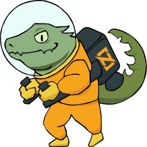

<h1 align="center" style="display:flex; flex-direction: row; justify-content: center; align-items: center">

</h1>

## What is this ? :lizard:

"it’s a mind sport. It more fully develops your algorithmic reasoning skills and bridges the gap between theory and application in bite-sized chunks. Full participation develops problem solving intuition and competence" - Steven Halim in his book **Competitive Programming 4.**

_In this repository you will see a collection of my competitive programming solutions in Zig_

## :balloon: Online Judges :balloon:

- #### [CodeWars](https://codewars.com/)
- #### [BeeCrowd](https://www.beecrowd.com/)
- #### [LeetCode](https://leetcode.com/)

---

### References

- [1] [Competitive Programming 4](https://cpbook.net/) I definitely recommend the two books by Steve Halim called "Competitive Programming 4" They provide valuable insights

<h4 align="center" style="display:flex; flex-direction: row; justify-content: center; align-items: center">

Please leave a star ⭐

</h4>
